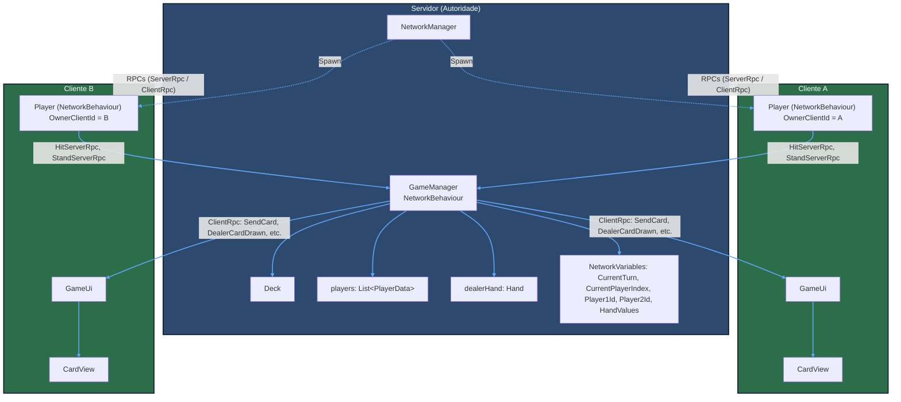

# Blackjack Multiplayer com Unity Netcode for GameObjects

## Introdução

Este é o meu projecto para a disciplina de Sistemas de Redes para Jogos, consiste de um jogo de Blackjack 2d em unity para dois jogadores utilizando **Netcode for GameObjects**
para lidar com sistema de redes. A arquitetura é de **Autoridade total do servidor**, ou seja, qualquer calculo ou ação lógica no jogo é feita a nivel do servidor, o cliente apenas 
lida com o UI. O jogo funciona com um sistema **Cliente-Servidor** em vez de Host-Client, pois não só foi o sistema que o professor da cadeira usou durante as aulas como também foi 
o sistema que me pareceu mais interessante de implementar.

## Scripts

|Nome | Função/Descrição |
|------|--------|
|Enum_Turn|Enum que contem os varios turnos do jogo|
|Enum_Suit|Enum que contem os diversos naipes das cartas do baralho|
|Card.cs| Struct que representa a parte lógica das cartas do jogo, contem o seu valor e naipe, serializável em rede com INetworkSerializable|
|CardView.cs| Classe que trata da componente visual das cartas, dependendo do valor e naipe defenido em Card.cs associa um sprite adequado|
|Deck.cs| Classe que representa a lógica do baralho, inicializa 52 cartas embaralha usando Fisher-Yates e permite sacar cartas|
|Hand.cs| Classe que representa a lógica da mão (grupo de cartas na posse da entiedade (jogador/dealer)) verifica se acontece bust e blackjack|
|Player.cs| NetworkBehaviour anexado ao prefab do jogador. Contém ServerRpc para hit, stand e exit. apenas afetam o cliente que os chamou|
|PlayerData.cs| Classe que representa os dados de cada jogador no servidor, contem ID, mão, e boolean de stand|
|GameUi.cs| Classe singleton que trata do UI do cliente, exibe cartas, textos com os valores das pontuações, botões, indicadores de turno e tela de fim de jogo. Reage a NetworkVariable.OnValueChanged e chama Rpcs para pedir permissão ao servidor por parte do cliente|
|GameManager.cs| NetworkBehaviour principal do projecto, um singleton que gerencia o fluxo do jogo, turnos, NetworkVariables, e Rpcs, maior parte das ações do servidor são feitas neste script|

## Técnicas utilizadas

- **Netcode for GameObjects**:
    - NetworkVariable para sincronizar o estado do jogo
    - ServerRpc e ClientRpc para comunicar entre Server e cliente, sendo que como é de **Autoridade total do servidor** seria sempre para pedir permissão ao servidor e mandar as informações para todos os clientes
    - NetworkBehaviour e NetworkObject para componentes de rede (retirados/inspirados nos utilizados nas aulas)
    - INetworkSerializable ns struckt de Card para facilitar um pouco a minha vida
- **Padrão Singleton**: 
    - GameManager.cs é um singleton
    - GameUi.cs é um singleton
- **Algoritmo de Fisher-Yates**:
    - Este algoritmo foi me recomendado por um colega fora do curso, é possivel que tenha sido falado nas aulas também.
    - O algoritmo consiste de uma maneira eficiente para embaralhar que não é tão dependente do random basico do unity quanto outros metodos
    - Começa-se com o ultimo elemento da lista e define-se esse indice como N-1, a seguir gera-se um indice I aleatório entre x e o indice atual (inclusivo), Reduz-se o indice atual em 1 até chegar a 0

## Bibliografia

- [Videos das Aulas do professor Diogo Andrade](https://www.youtube.com/@diogoandrade9588)
- [Unity Netcode for GameObjects Documentation](https://docs.unity3d.com/Packages/com.unity.netcode.gameobjects@2.12/manual/index.html)
- [COMPLETE Unity Multiplayer Tutorial (Netcode for Game Objects): Code Monkey](https://youtu.be/3yuBOB3VrCk?si=LeFLFHHggXOSSYkh)
- [How to use RPCs in Netcode - Unity 6 Tutorial - Part 4: Sunny Valley Studio](https://youtu.be/c6r1yzZRUzQ?si=ofGxPg_Ah5wKuXYF)
- [Getting started with networking concepts: Unity](https://youtu.be/kVt0I6zZsf0?si=FwfkuWIOcx1K2mxe)
- [Fisher–Yates shuffle in C#: Stack Overflow](https://stackoverflow.com/questions/56378647/fisher-yates-shuffle-in-c-sharp)

## Diagrama de arquitectura de redes

Lembrando que o sistema segue uma arquitetura **Cliente-Servidor** com **Autoridade total do servidor**

## Componentes em rede
- NetworkManager (Unity): gerencia conexões e spawn de objetos
- GameManager: NetworkBehaviour que centraliza a lógica
- Player: NetworkBehaviour pretencente a cada cliente com um OwnerClientId
- Variaveis NerworkVariable: 
    - CurrentTurn: usado para guardar o turno atual do jogo
    - CurrentPlayerIndex: usado para guardar o indice do jogador que está a jogar no momento
    - Player1Id: usado para guardar o Id do jogador 1 
    - Player2Id: usado para guardar o Id do jogador 2
    - Player1HandValue: usado para guardar o valor da mão do jogador 1
    - Player2HandValue: usado para guardar o valor da mão do jogador 2
    - DealerHandValue: usado para guardar o valor da mão do Dealer
- ClientRpc:
    - SendCardClientRpc: Envia uma carta para um jogador especifico
    - DealerCardDrawnClientRpc: Envia uma carta do dealer para todos os clientes
    - ClearTableClientRpc: Limpa a todos os elementos visuais do jogo 
    - OnPlayerWinClientRpc: Mostra a mensagem de vitória para o jogador vencedor
    - OnPlayerLoseClientRpc: Mostra a mensagem de derrota para o jogador derrotado
    - OnPlayerPushClientRpc: Mostra a mensagem de empate para os jogadores
    - NotifyOpponentExitClientRpc: Notifica o jogador que permaneceu que o oponente saiu
- ServerRpc:
    - HitServerRpc: Solicita uma carta (Hit) ao servidor
    - StandServerRpc: Solicita que o servidor pare (Stand)
    - ExitGameServerRpc: Solicita a saida do jogo (disconexão voluntária)

## Diagrama de protocolo

```mermaid
sequenceDiagram
    participant ClientA as Cliente A (UI)
    participant Server as Servidor (GameManager)
    participant ClientB as Cliente B (UI)

    Note over ClientA,Server: 1. Conexão e registo
    ClientA->>Server: Connect()
    Server-->>ClientA: OnClientConnected
    Server->>Server: Registration(ClientA)
    Server-->>ClientA: (Player object spawned)

    ClientB->>Server: Connect()
    Server-->>ClientB: OnClientConnected
    Server->>Server: Registration(ClientB)
    Server-->>ClientB: (Player object spawned)

    Note over Server: players.Count == 2 → StartRound()

    Note over ClientA,Server: 2. Distribuição inicial (dealing)
    Server->>Server: DealFirstCards()
    loop Para cada jogador (2 cartas)
        Server->>ClientA: SendCardClientRpc(card)
        ClientA->>ClientA: UI mostra carta
        Server->>ClientB: SendCardClientRpc(card)
        ClientB->>ClientB: UI mostra carta
    end
    Server->>ClientA: DealerCardDrawnClientRpc(card1)
    Server->>ClientB: DealerCardDrawnClientRpc(card1)
    Server->>ClientA: DealerCardDrawnClientRpc(card2)
    Server->>ClientB: DealerCardDrawnClientRpc(card2)

    Note over Server: CurrentTurn = player, CurrentPlayerIndex = 0

    Note over ClientA,Server: 3. Turno do jogador A
    ClientA->>Server: HitServerRpc() (via Player)
    Server->>Server: PlayerHit(clientA)
    Server->>Server: Saca carta, atualiza mão
    Server->>ClientA: SendCardClientRpc(card)
    ClientA->>ClientA: UI mostra carta
    alt Jogador A não estourou
        ClientA->>Server: StandServerRpc()
        Server->>Server: PlayerStand(clientA) → NextTurn()
        Note over Server: CurrentPlayerIndex = 1
    else Jogador A estourou
        Server->>Server: NextTurn() (automático)
        Note over Server: CurrentPlayerIndex = 1
    end

    Note over ClientA,Server: 4. Turno do jogador B (similar)
    ClientB->>Server: HitServerRpc()
    Server->>Server: PlayerHit(clientB)
    Server->>ClientB: SendCardClientRpc(card)
    ClientB->>ClientB: UI mostra carta
    ClientB->>Server: StandServerRpc()
    Server->>Server: PlayerStand(clientB) → NextTurn()

    Note over Server: CurrentPlayerIndex >= players.Count → DealerTurn()

    Note over ClientA,Server: 5. Turno do dealer
    loop Enquanto dealer hand < 17
        Server->>Server: Saca carta, adiciona à mão
        Server->>ClientA: DealerCardDrawnClientRpc(card)
        Server->>ClientB: DealerCardDrawnClientRpc(card)
    end

    Note over Server: Conclusion() – calcula resultados

    Server->>ClientA: OnPlayerWinClientRpc (ou Lose/Push)
    ClientA->>ClientA: UI mostra resultado
    Server->>ClientB: OnPlayerLoseClientRpc (ou Win/Push)
    ClientB->>ClientB: UI mostra resultado

    Note over Server: EndRound() – limpa mesa, aguarda PlayAgain

    Note over ClientA,ClientB: 6. Nova rodada (opcional)
    ClientA->>Server: PlayAgainServerRpc()
    ClientB->>Server: PlayAgainServerRpc()
    Server->>Server: readyToPlayAgain.Count == 2 → StartRound()
```

## Tipos de mensagens

|Origem|Destino|Tipo|Descrição|
|------|-------|----|---------|
|Cliente|Servidor|ServerRpc|Comandos do jogador que precisam ser permitidos e efetuados pelo servidor|
|Servidor|Cliente|ClienteRpc|Actualizações de UI que o servidor ordena aos clientes|
|Servidor|Todos|NetworkVariable|Sincronização de valores e estados|

## Problemas com o meu projecto
- O meu jogo aceita apenas dois jogadores, eu não sabia como implementar de maneira a aceitar qualquer numero de jogadores, se eu fosse continuar a trabalhar neste projecto implementaria uma maneira de selecionar quantos jogadore por partida se quer
- O meu jogo não tem qualquer tipo de animação ou som, não só porque eu não me organizei bem o suficiente para ter tempo para os implementar, mas também porque pelo que ouvi dizer de colegas meus é uma dor de cabeça enorme
- O sistema de blackjack está incompleto, o dealer por exemplo deveria começar com só uma carta virada e a outra por virar, só no turno dele viraria a carta e tiraria o resto do baralho
- O baralho não é recriado automaticamente se chegar ao fim, o que eu não achei necessário implementar na altura visto que num jogo de blackjack com 2 players e 1 dealer nunca utilizaria 52 cartas numa unica ronda
- Como eu criei o jogo primeiro em single player e só depois fui tentando implementar o jogo online encontrei diversas dificuldades que provavelmente não teria encontrado se tivesse começado logo a pensar no online
- Não há sistema de apostas, a minha ideia era implementar um sistema de fichas que ficaria ligado ao login do jogador e dependendo da quantidade de fichas o matchmaking iria te ligar com jogadores com quantidades parecidas

## Conclusão

Neste projecto acho que consegui demonstrar as minhas capacidades e conhecimentos na cadeira de redes,mesmo que não tenha conseguido entregar o projecto com a qualidade que pretendia, senti que ao meter em pratica fui aprendendo mais e provavelmente nunca farei um jogo online sozinho, esta cadeira traumatizou me com sucesso

##### Trabalho realizado por Diogo Meira Fonseca aluno numero a22402652

